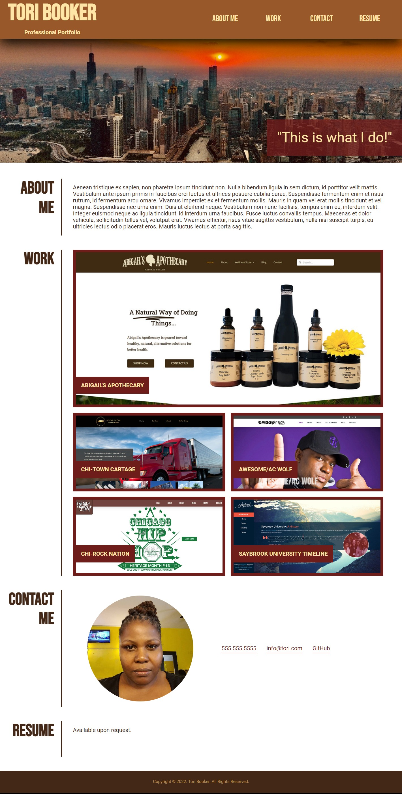

# 01 Professional Portfolio

## Description

The goal of this assignment was to build a portfolio page I can add to as the course progresses. In addition to building this online portfolio, I will be applying the core skills I've recently learned which are flexbox, media queries, and CSS variables.

## Installation

Click here: https://ebonygrrl.github.io/02-professional-portfolio/

## Usage

To use this application, you can click on one of the links in the navigation to jump to a particular section or scroll to bottom. There is also a button when clicked that will jump to the top of the application.

The following image shows the web application's previous appearance and functionality:

## Credits

N/A

## License

Please refer to the LICENSE in the repo.
